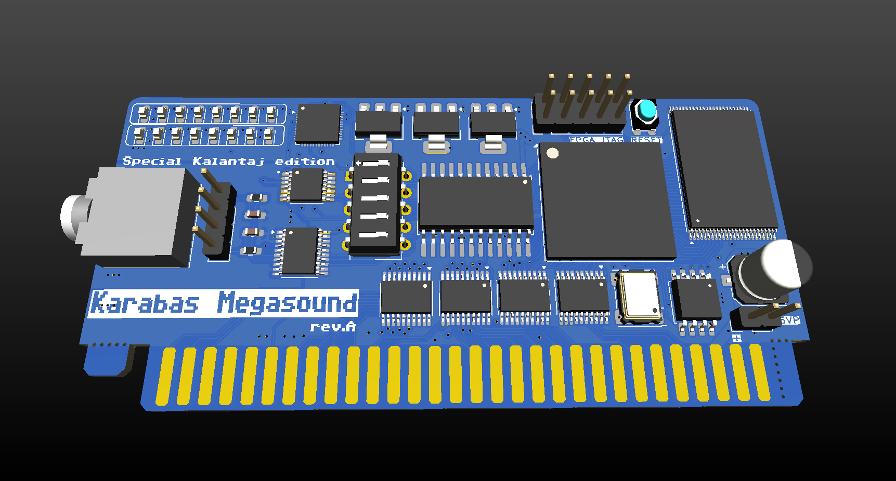
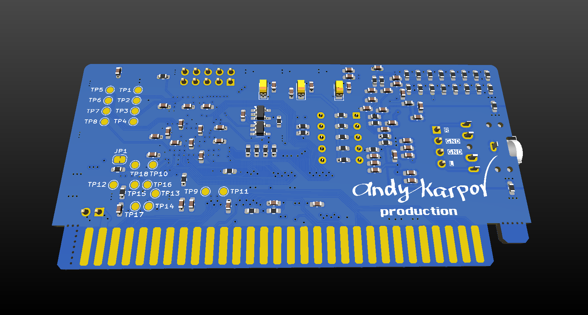

## Karabas-MegaBuzz

Simple FPGA based sound card for ZX Spectrum (NemoBus). 
Inspired by a ZX-Multisound and karabas-opl3 soundcards :)

### Tech specs

* Turbosound FM
* General Sound 2 MB
* OPL3 sound by YMF-262-M
* MIDI by Dream SAM2695
* SAA1099
* Soundrive, Covox + Beeper
* 16-bit DAC PCM5102
* XC6SLX16 / XC6SLX25 FPGA
* Low profile PCB: 92x44mm
* 5V only power required

### Changelog & current status

* Rev.A - initial release [ERRATA](ERRATA.md)

### Related projects

* Karabas-OPL3 - [link](https://github.com/andykarpov/karabas-opl3)
* BomgeMoon - [link](https://github.com/Kulicheg/BomgeMoon)
* ZX-Multisound - [link](https://github.com/UzixLS/zx-multisound)
* Turbo Sound FM - [link](http://www.nedopc.com/TURBOSOUND/ts-fm.php)
* ZXM-SoundCard - [link](http://micklab.ru/My%20Soundcard/ZXMSoundCard.htm)
* ZXM-GeneralSound - [link](http://micklab.ru/My%20Soundcard/ZXMGeneralSound.htm)
* NeoGS - [link](http://www.nedopc.com/gs/ngs.php)
